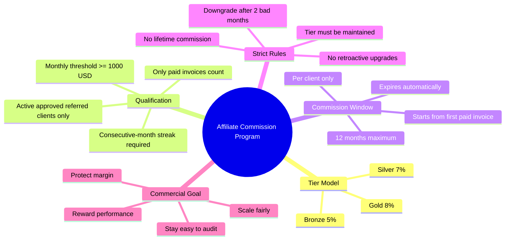
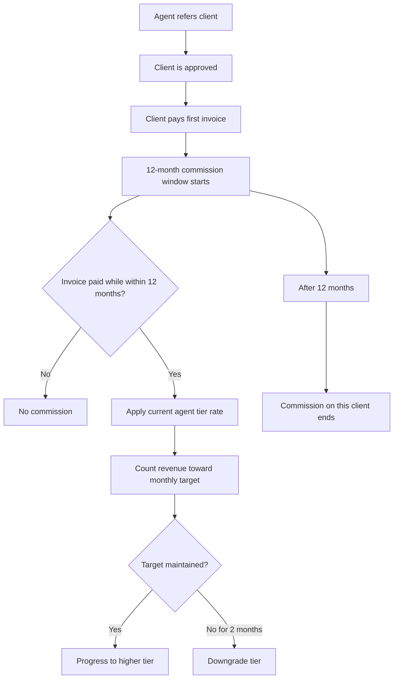

# Affiliate Commission Program

## Final Recommendation

Prepared for client review

## Executive Summary

This document recommends a professional affiliate / commission-agent program for PrepCorex that is:

- simple to explain to agents
- financially protective for the company
- performance-based
- strict in qualification and maintenance
- limited to one year of commission per referred client

### Final recommended model

- Use a **percentage-based commission**, not a flat-dollar commission.
- Start every approved commission agent at **Bronze = 5%**.
- Upgrade agents to **Silver = 7%** and **Gold = 8%** only when they meet strict monthly revenue and consistency requirements.
- Pay commission on each referred client for **12 months only** from that client's activation / first qualified paid invoice date.
- Use a **strict model**:
  - no retroactive upgrades
  - no lifetime rate lock
  - downgrade if targets are missed
  - only paid invoices count
  - only active approved clients count

This is the recommended approach because it balances motivation for agents with stronger margin protection for the business.

---

## Why This Model Is Recommended

### Why percentage-based is better than flat `$5 / $7 / $8`

Flat-dollar commission is easy to understand, but it is weak commercially because:

- a `$5` payout may be too high on a small invoice
- a `$5` payout may be too low on a large invoice
- it does not scale fairly as client invoice sizes grow
- it is harder to defend financially long term

Percentage-based commission is more professional because:

- it scales with actual revenue
- it protects margin better
- it is easier to audit
- it aligns agent reward with business value created

### Final recommendation

Use:

- **Bronze: 5%**
- **Silver: 7%**
- **Gold: 8%**

These rates match your original idea of `5 -> 7 -> 8`, but in a more sustainable way.

---

## Final Tier Structure

### Bronze Partner

- Default starting tier for every newly approved commission agent
- Commission rate: **5%**
- Applies immediately after approval

### Silver Partner

- Commission rate: **7%**
- Agent must generate at least **$25,000 in paid referred-client revenue per month**
- Agent must maintain this for **3 consecutive months**

### Gold Partner

- Commission rate: **8%**
- Agent must continue generating at least **$50,000 in paid referred-client revenue per month**
- Agent must maintain this for **6 consecutive months total**

---

## Strict Commercial Rules

This recommendation uses a **strict / margin-protective model**.

### Rule 1: Commission is paid for one year only per client

- Every referred client has a **12-month commission window**
- Commission starts when the client becomes a qualified referred customer
- Recommended start date:
  - the date of the client's **first paid invoice**
- After 12 months, that client's future invoices generate **zero commission**

### Rule 2: Only paid invoices count

- Pending invoices do not count
- Unpaid invoices do not count
- Rejected / cancelled / deleted accounts do not count

### Rule 3: Upgrades are not retroactive

- If an agent reaches Silver or Gold, the new rate applies only to **future qualifying invoices**
- Past invoices stay at the rate that was active at the time

### Rule 4: Revenue target must be maintained monthly

- Monthly revenue is measured as:
  - **sum of paid invoice revenue from referred clients whose 12-month commission window is still active**

### Rule 5: Downgrade if performance drops

This is the recommended strict behavior:

- If a Silver or Gold agent falls below the required monthly target for **2 consecutive months**, downgrade by one tier
- If a Bronze agent stays below target, they remain Bronze
- If a Gold agent misses target for 2 months:
  - Gold -> Silver
- If a Silver agent misses target for 2 months:
  - Silver -> Bronze

### Rule 6: No permanent tier lock

- Tiers are performance privileges, not permanent entitlements
- Agents must continue earning their tier through real monthly production

### Rule 7: Only approved active clients are included

- Client must be:
  - referred by that agent
  - approved / active
  - within 12-month commission window
  - paying invoices successfully

---

## Recommended Qualification Logic

### Qualified revenue definition

Qualified revenue for an agent in a given month:

- sum of all **paid invoices**
- from clients referred by that agent
- where the client is still inside the 12-month commission eligibility period

### Consecutive month logic

- Month qualifies only if monthly qualified revenue is **>= $1,000**
- Missing the threshold breaks the streak

### Upgrade logic

- Bronze -> Silver:
  - 3 consecutive qualifying months
- Silver -> Gold:
  - 6 consecutive qualifying months

### Downgrade logic

- Gold -> Silver:
  - 2 consecutive non-qualifying months
- Silver -> Bronze:
  - 2 consecutive non-qualifying months

---

## Recommended Business Policy

### Commission window per client

- **12 months maximum**
- This should be clearly stated in the affiliate agreement

### Suggested wording

> Commission is payable on eligible paid invoices from referred clients for a maximum period of twelve (12) months per referred client, beginning from the date of the referred client's first paid invoice.

### Why this is strong commercially

- prevents indefinite commission leakage
- keeps acquisition economics under control
- rewards the agent for winning the client, not owning the client forever
- creates a fair but disciplined model

---

## Mind Map: Final Program Structure

## Flow Summary

---

## Example Scenarios

### Example 1: Bronze to Silver

- Agent starts at Bronze = 5%
- In January, referred clients generate `$1,200` paid revenue
- In February, referred clients generate `$1,050`
- In March, referred clients generate `$1,300`
- Agent qualifies for Silver
- From April onward, future eligible invoices pay **7%**

### Example 2: Silver to Gold

- Agent continues hitting monthly target
- By the 6th consecutive qualifying month, agent reaches Gold
- From the next month onward, future eligible invoices pay **8%**

### Example 3: Downgrade

- Gold agent falls below `$1,000` in July
- Again falls below `$1,000` in August
- Agent is downgraded to Silver for September

### Example 4: One-year client cap

- Client A first pays on `March 10, 2026`
- Agent earns commission on Client A's eligible paid invoices until `March 9, 2027`
- From `March 10, 2027` onward, Client A generates **no commission**

---

## What Should Be Shown on the Affiliate Dashboard

To make the program clear and motivating, the affiliate dashboard should show:

- current tier badge
- current commission rate
- this month's qualified revenue
- number of active commission-eligible clients
- consecutive qualifying months
- next tier target
- countdown / months left until each client commission expires
- pending commission balance
- paid commission history

### Recommended badges

- Bronze Partner
- Silver Partner
- Gold Partner

### Recommended helper text

- `Current Rate: 5%`
- `Qualified Revenue This Month: $820 / $1,000`
- `Streak: 2 / 3 months toward Silver`
- `Client Commission Window: 12 months per client`

---

## Final Recommendation to Approve

PrepCorex should adopt the following affiliate commission policy:

1. Use a **tiered percentage model**
   - Bronze `5%`
   - Silver `7%`
   - Gold `8%`
2. Pay commission for **12 months only per referred client**
3. Start each client's commission clock from the **first paid invoice**
4. Count only **paid revenue** from active referred clients
5. Require **$1,000 monthly qualified revenue**
6. Upgrade only after consistent performance
   - 3 months for Silver
   - 6 months for Gold
7. Use a **strict downgrade model**
   - downgrade after 2 consecutive underperforming months
8. Do **not** apply upgrades retroactively

This is the strongest recommendation because it is commercially disciplined, easy to justify to clients and agents, and scalable for long-term operations.

---

## Optional Future Enhancements

Later, the program can be expanded with:

- Platinum tier
- payout schedules
- clawback rules for refunded invoices
- dashboard progress bars
- client-expiry tracker
- leaderboards
- automated monthly tier review jobs

